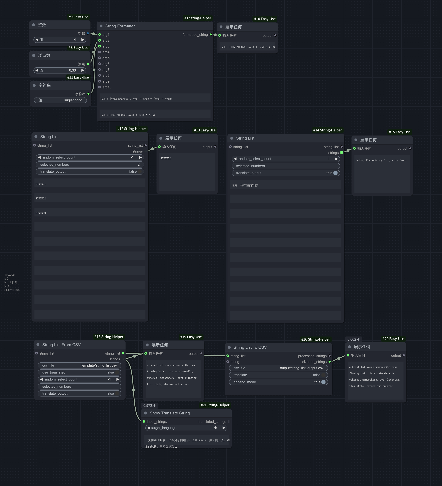

# ComfyUI 字符串自定义节点

ComfyUI的字符串相关的自定义节点，其中包括 String Formatter、StringList 节点。此节点设计旨在提高用户在处理字符串时的效率和灵活性。



> 直接拖入ComfyUI即可使用

## 安装方法

1. 将此仓库克隆到你的 `ComfyUI/custom_nodes` 目录下：
```bash
cd custom_nodes
git clone https://github.com/liuqianhonga/ComfyUI-String-Helper.git
```
2. 重启 ComfyUI

## String Formatter 节点使用说明

字符串格式化节点允许你使用Python的f-string语法来格式化字符串。你可以在模板字符串中引用最多10个输入参数（arg1到arg10）且自由定制模板。对于复杂的语法，需要了解Python的f-string格式化语法。

### 节点参数

- **template** (必需)：使用f-string语法的模板字符串
- **arg1** - **arg10** (可选)：可在模板中引用的输入参数

### 使用示例

1. 基础文本格式化：
```python
arg1: "小明"
arg2: "ComfyUI"

模板: "你好 {arg1}，欢迎来到 {arg2}！"
输出: "你好 小明，欢迎来到 ComfyUI！"
```

2. 数字使用示例：
```python
arg1: 10
arg2: 20
arg3: 30

模板: "计算结果: {arg1} + {arg2} = {arg3}"
输出: "计算结果: 10 + 20 = 30"
```

3. 对象使用示例：
```python
arg1: {"名称": "模型_v1", "类型": "checkpoint"}

模板: "模型信息: {arg1}"
输出: "模型信息: {'名称': '模型_v1', '类型': 'checkpoint'}"
```


### 注意事项

- 未提供的参数（None值）将被忽略
- 节点支持任何类型的输入（字符串、数字、列表、字典等）
- 同一个参数可以在模板中多次使用
- 支持Python f-string的所有格式化特性

### 错误处理

如果模板或格式化过程中出现错误，节点将返回错误信息字符串：
```python
当引用了未提供的参数时：
模板: "你好 {arg1}，{arg2}"
arg1: "世界"
输出: "Format Error: name 'arg2' is not defined"
```

## StringList 节点使用说明

StringList 节点允许你灵活地选择和翻译字符串。你可以通过手动输入、随机选择或指定编号选择字符串，并可选地将其翻译为英文。

### 节点参数

- **random_select_count** (必需)：随机选择字符串的数量。特殊值:
  - `-1`：返回所有输入字符串
  - `0`：返回空列表
  - `1-10`：随机选择指定数量的字符串
- **selected_numbers** (可选)：指定要选择的字符串编号，多个编号用逗号分隔，如"1,3,5"。当此字段有值时，`random_select_count` 失效
- **translate_output** (可选)：布尔值，默认为 `False`。启用后，将选定的字符串从自动检测的语言翻译为英文
- **string1** - **string10** (必需)：多行字符串输入字段，用于手动输入字符串
- **string_list** (可选)：额外的字符串列表输入，用于合并外部字符串列表

### 使用示例

1. 随机选择字符串：
```python
random_select_count: 3
translate_output: False
string1: "你好"
string2: "世界"
string3: "欢迎"
输出: 随机选择3个字符串
```

2. 指定编号选择字符串：
```python
selected_numbers: "1,3"
translate_output: True
string1: "你好"
string2: "世界"
string3: "欢迎"
输出: ["Hello", "Welcome"]
```

3. 使用外部字符串列表：
```python
random_select_count: 2
string_list: ["额外1", "额外2"]
输出: 随机选择2个字符串并合并外部列表
```
